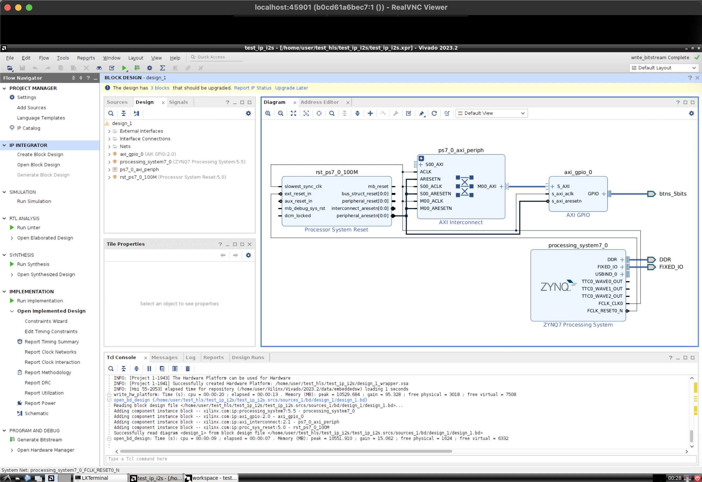
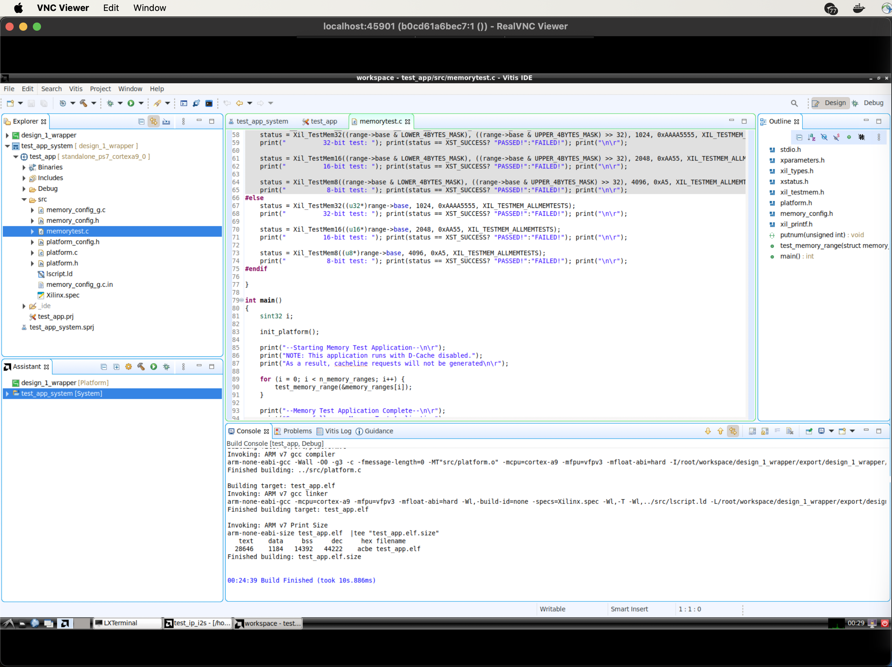
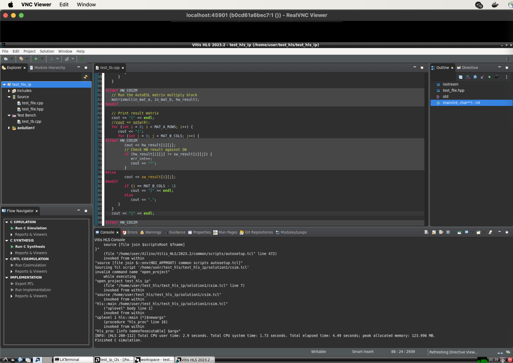

## Container base:
https://hub.docker.com/r/accetto/ubuntu-vnc-xfce/

## Vivado on Apple silicon:
https://github.com/ichi4096/vivado-on-silicon-mac

## Container first launch and Vivado installation:
1) Download Xilinx official WebVersion Linux installer. Copy it to the root of the repo.

2) Build the container

```sh
## Without Litex framework support
docker build -t me_vivado_apple --target vivado_build_target .
## With Litex framework support
docker build -t me_vivado_apple --target with_litex .
```

3) Launch the container with the mounted path to /home user
```sh
docker run --rm --name vivado_container -p 45901:5901 -p 46901:6901  \
--mount type=bind,source="/Users/$USER/Documents/vivado-on-silicon-mac_with_vnc",target="/home/user" \
docker.io/library/me_vivado_apple
```

3.1) The container can be optionally launched with the mounted directory to external project sources
```sh
docker run --rm --name vivado_container -p 45901:5901 -p 46901:6901  \
--mount type=bind,source="/Users/$USER/Documents/vivado-on-silicon-mac_with_vnc",target="/home/user" \
--mount type=bind,source="/Users/$USER/Documents/Development/pluto_build",target="/home/user/pluto" \
docker.io/library/me_vivado_apple
```

4) In the separate console session connect to the running container. For that execute
```docker ps```
You'll see the running **CONTAINER ID**. Connect to the docker container:
```docker exec -it id_of_the_container /bin/bash```

5) Extract installer to **/home/user/installer**

```sh
/home/user/installers/FPGAs_AdaptiveSoCs_Unified_2023.2_1013_2256_Lin64.bin --target /home/user/installer_extracted --noexec
```

6) If the custom configuration is required - generate config. By default the install_config.txt can be used.

```sh
/home/user/installer_extracted/xsetup -b ConfigGen
```

7) Generate your auth token. You'll be promted to enter you e-mail and password for AMD account.

```sh
/home/user/installer_extracted/xsetup  -b AuthTokenGen
```

8) Start the installation

```sh
/home/user/installer_extracted/xsetup --agree XilinxEULA,3rdPartyEULA -b Install -c /home/user/install_config.txt
```


## Vivado tool launch
```sh
/home/user/Xilinx/Vivado/*/settings64.sh
/home/user/Xilinx/Vivado/*/bin/vivado
```

## Litex example build for EBAZ4205 board with X5 crystal for PL soldered
```sh
export LITEX_ENV_VIVADO=/home/user/Xilinx/Vivado/2023.1/
python3 -m litex_boards.targets.ebaz4205 --build --output-dir=/home/user/litex_bulild_from_template
```

## Programmer setup:
1) Build the repo:
https://github.com/jiegec/jtag-remote-server

```
system_profiler SPUSBDataType
./jtag-remote-server -p 6010 -x
host.docker.internal
```
TODO: describe the flashing flow in detail

## Zephyr simple test
```sh
source /home/zephyr_setup/zephyr/zephyr-env.sh 
cmake -DBOARD=qemu_riscv32 $ZEPHYR_BASE/samples/hello_world
```

## Serial port forwarding
```sh
brew install ser2net
brew install minicom
```

To configure ser2net, edit the example configuration in
`/opt/homebrew/etc/ser2net/ser2net.yaml`

To start ser2net now and restart at login:
`brew services start ser2net`
Or, if you don't want/need a background service you can just run:
`/opt/homebrew/opt/ser2net/sbin/ser2net -p 12345`

Look for your USB-serial adapter:
```sh
system_profiler SPUSBDataType
```
Connect to it via minicom for loopback test(RX&TX wires should be connected to each other)
```sh
sudo minicom --device /dev/tty.usbserial-5 --baudrate 115200
```

Create config file for ser2net utility with the found USB-serial adapter:
```yaml
connection: &con00
  accepter: tcp,3333
  connector: serialdev,/dev/tty.usbserial-5,115200n81,local
```

Launch utility with the given config file:
```sh
ser2net -c ser2net_config.yaml -n
```

In Docker container launch socat and minicom:
```ssh
socat pty,link=$HOME/dev/ttyV0,waitslave tcp:host.docker.internal:3333
sudo minicom --device /home/headless/ttyV0 --baudrate 115200
```
Usefil links:
https://techtinkering.com/2013/04/02/connecting-to-a-remote-serial-port-over-tcpip/
https://www.baeldung.com/linux/make-virtual-serial-port

## Screenshots
### Sample design with ZYNQ Processing System IP


### Vitis IDE


### Vitis HLS


## Bugfix for realloc failure:
https://support.xilinx.com/s/article/000034450?language=en_US
```sh
LD_PRELOAD=/lib/x86_64-linux-gnu/libudev.so.1 /home/user/Xilinx/Vivado/2023.2/bin/vivado
```